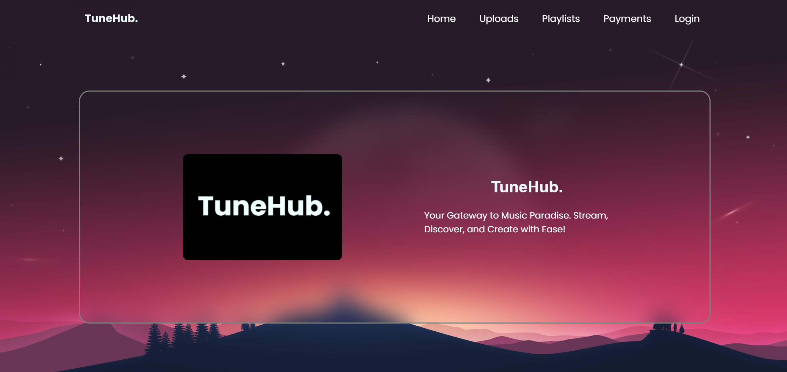
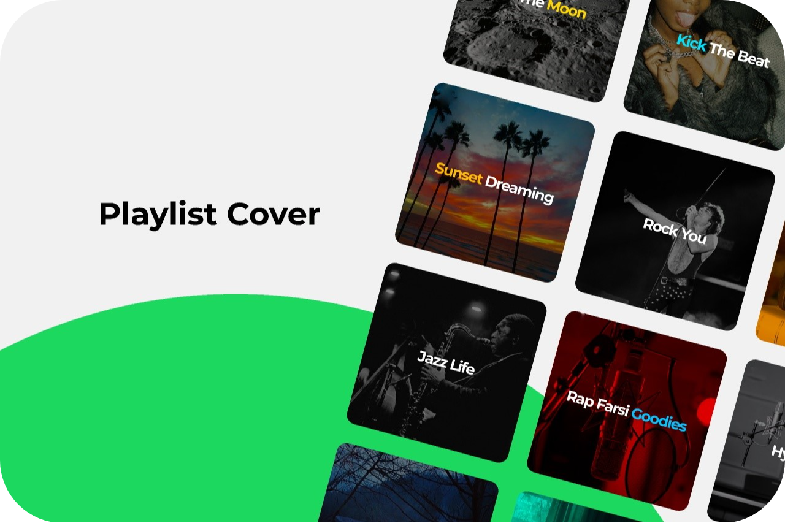

# TuneHub  

  TuneHub is an audio streaming web application that allows 
  users to enjoy a wide range of songs. It offers a premium 
  subscription for users to access additional features such 
  as ad-free streaming and high-quality audio. For users who 
  do not have a premium subscription, TuneHub provides an 
  option to make payments through Razorpay to unlock premium 
  features.

  

## Features

- **Streaming**: Listen to your favorite songs online.
- **Premium Subscription**: Unlock ad-free streaming and high-quality audio with a premium subscription.
- **Payment Integration**: Securely make payments through Razorpay for premium subscriptions.
- **Playlist Panel**: Admins can create playlists in the platform.
- **Admin Panel**: Admins can upload songs to the platform.

  
  
  

## Technologies Used

- **Frontend**: HTML, CSS, JavaScript
- **Backend**: Java, Spring Boot
- **Database**: MySQL
- **Payment Integration**: Razorpay
- **Tools**: Spring Tool Suite

## Contributing

We welcome contributions to TuneHub! You can also open an issue if you have any suggestions or find any bugs. If you'd like to contribute, please fork the repository and submit a pull request or ping me 
 at vinaybabulingala@gmail.com

---

Feel free to customize this template as needed for your project's specific details and requirements!
